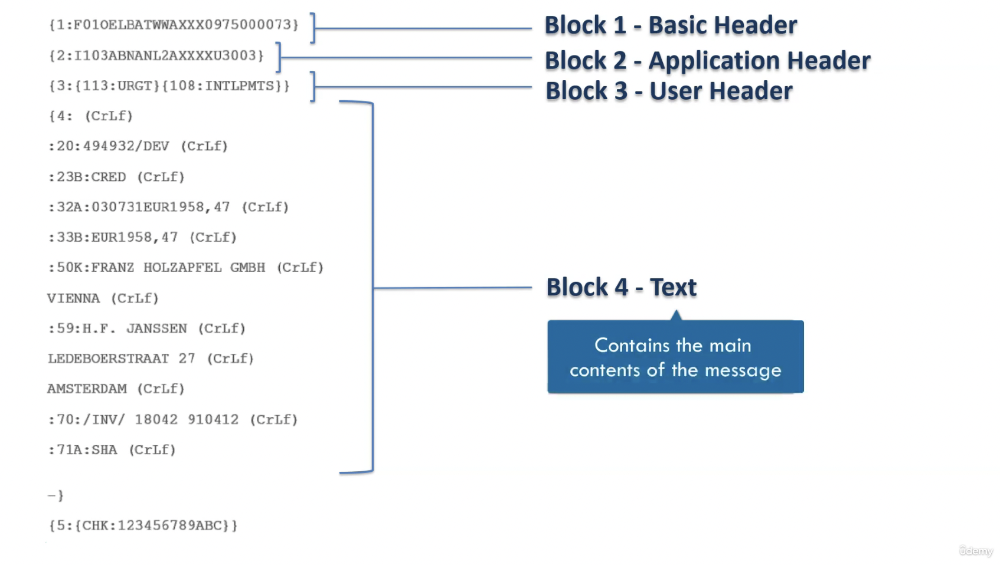
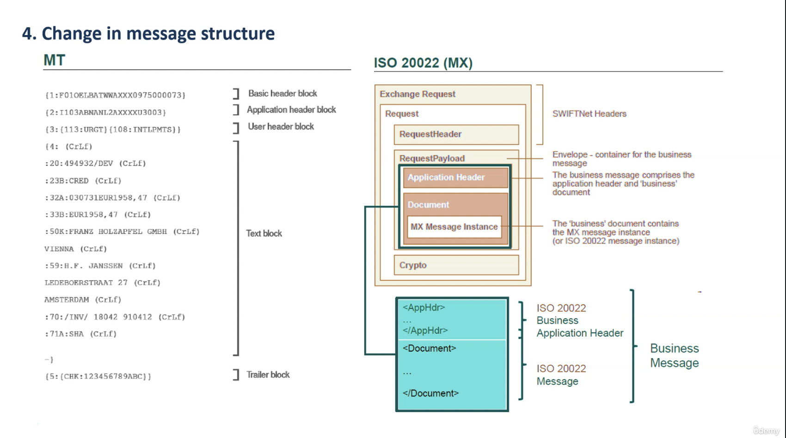
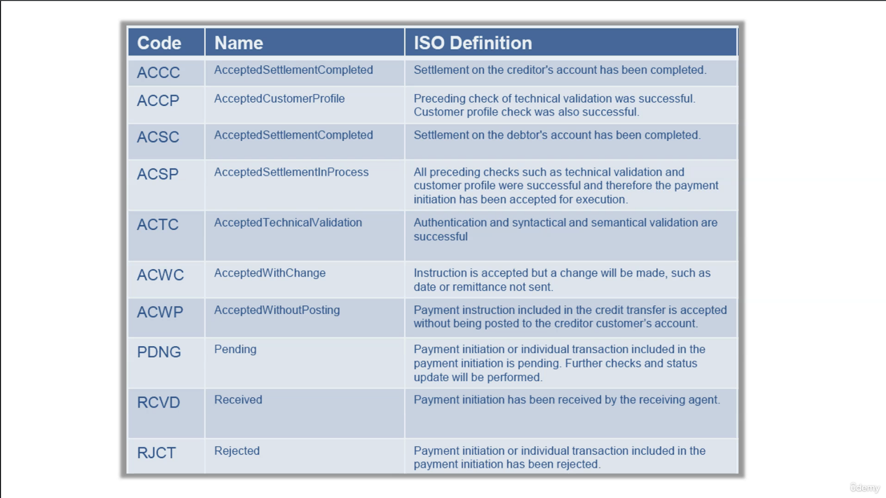

# SWIFT Message Types - MT and MX ISO 20022 - An Overview

## Contents

- Basic of Swift

    - [SWIFT, SWIFTNet and SWIFT Code/BIC](#swift-swiftnet-and-swift-codebic)

    - [SWIFT FIN and GPA Messages and MT Message Structure](#swift-fin-and-gpa-messages-and-mt-message-structure)

    - [SWIFT Message Categories and Rules/ Guidelines of Messages](#swift-message-categories-and-rules-guidelines-of-messages)

- Brief Overview of Payment System

    - [What is Clearing, Settlement and Messaging?](#what-is-clearing-settlement-and-messaging)

    - [Correspondent Accounts and RMA](#correspondent-accounts-and-rma)

- [SWIFT MT Messages - Understanding fields and flows with examples](#swift-mt-messages---understanding-fields-and-flows-with-examples)

    - [Category 1 Messages with MT 103 Serial and Cover methods](#category-1-messages-with-mt-103-serial-and-cover-methods)

    - [Category 2 Messages](#category-2-messages)

    - [Category 9 Messages](#category-9-messages)

    - [SWIFT GPA Messages/ Possible Duplicate Emission(PDE/PDM)/ Message Retrieval](#swift-gpa-messages-possible-duplicate-emissionpdepdm-message-retrieval)

- [SWIFT GPI and Other Latest Releases by SWIFT](#swift-gpi-and-other-latest-releases-by-swift)

    - [SWIFT GPI (Global Payments Innovation)](#swift-gpi-global-payments-innovation)

    - [ Latest - GPI Instant, Payment Pre-validation, Case Resolution, Stop and Recall](#latest)

- SWIFT ISO 20022 MX messages

    - [Need for MX Messages and the three layers of MX Messages](#need-for-mx-messages-and-the-three-layers-of-mx-messages)

    - [MT to MX Messages - What are the changes?](#mt-to-mx-messages---what-are-the-changes)

    - [PAIN (Payment Initiation Messages)](#pain-payment-initiation-messages)

    - [PACS(Payments Clearing and Settlement) and CAMT(Cash Management)](#pacspayments-clearing-and-settlement-and-camtcash-management)

- [References](#references)

## Basics of Swift

### SWIFT, SWIFTNet and SWIFT Code/BIC
SWIFT is the ‘Society for Worldwide Interbank Financial Telecommunication’, a member-owned cooperative through which the financial world conducts its business operations with speed, certainty and confidence. SWIFT enables customers to automate and standardize financial transactions, thereby lowering costs, reducing operational risk and eliminating inefficiencies from their operations.

SWIFT is solely a carrier of messages. It does not hold funds nor does it manage accounts on behalf of customers, nor does it store financial information on an on-going basis. As a data carrier, SWIFT transports messages between two financial institutions. This activity involves the secure exchange of proprietary data while ensuring its confidentiality and integrity.

Banks located in different locations in the world need to communicate with each other to perform their everyday operations. That communication forms the basis of numerous transactions taking place globally on a daily basis.\
Before the advent of SWIFT, banks used to communicate using telex, fax or phone, but it was very slow and not a secure way to communicate at all. So in 1973, around 239 banks from 15 countries created a cooperative headquartered in Belgium named Society for Worldwide
Interbank Financial Telecommunication, or SWIFT, to build a common messaging system.


Slowly, the number of member banks grew, and today more than 11000 banks are part of SWIFT communicating with each other using its network called SWIFTNet.


***But how will one member identify another member of SWIFTNet?***

_Using an ID_.\
This ID is called the business identifier code or the SWIFT code. Here **'B'** stands for business and not bank. You may wonder why, because not only banks are financial institutions, but corporate can also become a member of SWIFT to communicate their instructions with financial institutions directly.


The swift code acts not only as an entity or member identifier, but it also contains important information about the location of the entity, which is used to redirect a SWIFT message to it.

**Let's understand how.**

SWIFT code are 8 to 11 correctors in length, for example, let's see how a branch of Deutsche Bank in Germany gets identified using BIC.


The first four alphabetical letters stand for that business entity. Here, DEUT stands for Deutsche Bank. So anywhere in the world, any SWIFT code for Deutsche Bank will start with
DEUT. Next two alphabetical letters from the specific country code where the branch is located,
DE stands for Deutschland or Germany. The next two letters can be alphabetical or numeric and they stand for the institution head office in the country, or the head office in a particular region in the country. Here, SS stands for Stuttgart, a city in Germany. So, *DEUT DE SS* is a valid eight characters SWIFT code. And if you don't add further characters to this code, it will indicate that it's the code of the Deutsche Bank main branch at Stuttgart city of Germany.
Now suppose you need to reach a particular branch.
Then a further three letter code is added to the code. Here, **648** denotes a particular branch in the Stuttgart region.

Another Example

|  |  |
| --- | ----------- |
|  |  |
|  |  |

**More Readings**
- [Prowide - About SWIFT](https://www.prowidesoftware.com/resources/SWIFT)

### SWIFT FIN and GPA Messages and MT Message Structure

Let's understand now how members communicate among each other in a SWIFT network.\
Communication between members happened using standardized message formats. You can imagine messaging standards as predefined format so that when such messages are exchanged between two parties following the same standard, they can decode and understand what the counterpart is trying to convey.


There are many kinds of messaging standards which are used globally to communicate among banks. The two standardized messages which are supported by SWIFT are ***MT and MX messages***.


> The MT messages are structured according to the specifications of the ISO 15022 standard and the newer MX messages according to the ISO 20022 standard.


**Side Note:**\
*ISO or International Organization for Standardization is an independent, non-governmental international organization which develops standards which provide the best way of doing something. They have joined hands with SWIFT to create these messaging standards.*

Let's know more about MT messages.\
These standardized MT messages are exchanged under SWIFTNet FIN service. FIN stands for financial messaging application.\
The FIN service comprises of the following two applications:
- Financial Messaging Application
- General Purpose Application (GPA)


As pointed earlier that SWIFT MT messages follow ISO 15022 standard and here's how it looks like,


SWIFT messages consist of five blocks.

|  |  |
| --- | ----------- |
|  |  |
|  |  |
|  |


For more info, refer [SWIFT MT Message Structure Blocks 1 to 5](https://www.paiementor.com/swift-mt-message-structure-blocks-1-to-5/)

**More Readings**
- [SWIFTNet for Corporate](https://www.nordea.com/en/doc/file-transfer-swiftnet-factsheet.pdf)
- [SWIFT Messaging Services](https://www.swift.com/node/13491)

### SWIFT Message Categories and Rules/ Guidelines of Messages

We've discussed about the basic structure of MT messages and it's five building blocks. Now let us know what are the different categories of MT messages available under the FIN service?\
There are total nine categories and a separate category for common messages which can be used under any category. Together, SWIFT covers messaging requirements for payment, securities, trade finance and foreign exchange and treasury.\
Interestingly, SWIFT does not provide services for card payments.


Under each category, there are several messages. For example, under messages category 1 - customer payments and cheques, there is MT 101 - Request for transfer, MT 103 - Single customer credit transfer and so on.


Each message is denoted using three digits.
- The first digit denotes the category it belongs to.
- The second digit denotes the group. For example, '0' denotes electronic, '1' denotes paper-based.
- The third digit provides the specific function.


Now, to use these different types of messages correctly, SWIFT also provides some rules and guidelines to structure the messages. There are four kinds of rules and guidelines for structuring SWIFT messages.

<u>**1. MT Network Validated Rules (NVR)**</u>

Network Validated Rules are rules for which an error code is defined in SWIFT. When the rules specified affect more than one field in the message, thus placing a condition on one of the field specified, they are called CN or conditional rules. Below is the example of a NVR for a MT 103 message which is the message format used for customer credit transfer between banks. You can see how presence and absence of fields are dependent on each other. And if the rule is not followed, an error will be thrown by the software and you can't proceed
without rectifying that error.


<u>**2. MT Usage Rules**</u>

Usage rules are not validated on the network, meaning rules for which no area code is defined but are still mandatory for the correct usage of the message.


For example, usage rule for MT 103 message says, when the current method is used for customer credit transfer, the originating bank must copy the content of field 20 of the MT 103 unchanged into field 21 of the related MT 202 COV (COV will be discussed later).\
What the rule is trying to say is in the current method of customer payment, two messages are used simultaneously a MT 103 message and a MT 202 COV message and the content of a particular field of the MT 103 should be copied as it is
in another field of the MT 202 COV. Now that this is actually done on not, SWIFT has no method to check for itself because SWIFT has no way to compare
two different messages automatically and generate any warning or error. ***That's why SWIFT has designed usage rules such as these to educate the user of the correct usage of each message.***

<u>**3. MT Guidelines**</u>

Guidelines are neither validated on the network nor are mandatory for the correct usage of the message. They basically concern group practices and can affect more than one field in a message or more than one SWIFT message.


<u>**4. MT market practice rules**</u>

Market practice rules, as the name suggests, are a set of rules which are usually in practice or prevalent in the market. For example, the payments market practice group, or PMPG, is an independent body of payments subject matter experts from Asia Pacific, Europe and North America. It has published a set of market practice rules for category 2 messages proposing best practices and recommendations of structuring such messages.


**More Readings**
- [Oracle ® FLEXCUBE Universal Banking Messaging System User Guide](https://docs.oracle.com/cd/E74659_01/html/MS/MS13_SWIFT_Messages.htm#Rar71230)

## Brief Overview of Payment System

### What is Clearing, Settlement and Messaging?

We have got an overall idea of the background of SWIFT and the messages but before we can start understanding the SWIFT payment messages, we need to have a brief idea about one more concept, which is, how payments work.

There are three main elements of a payment system or a clearing and settlement system.

>Messaging, Clearing and Settlement


Let's understand what each means.

**1. Clearing**

First, what is meant by a clearing system. In simple words, it is reconciling and netting system before actual settlement of money can be done.

Let's take the simplest example of bilateral clearing. Two banks, A and B owe each other money. Bank A owes bank B five million dollars and bank B owes bank A seven million dollars. The two banks calculate between themselves and finally,bank B pays bank A two million dollars. This act is called netting or offsetting and this amount of two million is called the final position.


Now, imagine the same thing with multiple banks, the more nodes you act in the system, the more complicated and cumbersome it becomes for the banks to do the calculations. This is multilateral clearing without a clearing house.


Here comes the role of a clearing house, instead of connecting with each other,
the banks instead connect with the clearing and settlement system. In short, the CSM, comprising the clearing house and the central bank settlement mechanism. The clearing system calculates the final position of the participating banks once or several times daily and finally, pushes the actual settlement transaction through the central bank settlement mechanism.


To summarize,

- ***Clearing is reconciliation and netting process.***
- ***Settlement is the actual mechanism of moving the funds from one account to another.***

**2. Settlement**

Let’s know a little more about **settlement systems**. The example mentioned previously, where first netting of the transaction is done and then the final position amount is settled is called the ***net settlement system***.

There is another method called the ***gross settlement system***. Here, no netting is done and each transaction is settled individually.
So, here, first bank A's customer will originate the payment of seven million dollars through bank A. Bank A pushes the transaction through the CSM where the settlement accounts of the two banks are debited and credited.\
Next, on receiving the credit on its settlement account, the receiving back finally credits the beneficiary seven million dollars.\
The same process will get repeated then bank B's customer wants to send bank A’s customer five million dollars. As no netting is involved in this process,
it happens real time. Hence the name, ***real time gross settlement***.\
This system is used then urgent transfers are to be made and also for high value transfers.


Another kind of settlement is a ***Real Time Final Settlement System*** or RTFS. Unlike RTGS, where the ultimate beneficiary gets paid only after the sending bank and receiving banks settlement accounts in the CSM get settled.
Here, first the ultimate beneficiaries account is credited after doing a transaction validation and the settlement account of the banks are settled later.\
Examples of such systems are IMPS in India or CHIPS in the USA.


**3. Messaging**

This entire communication between banks and CSM happens using messages. This is where SWIFT comes in. So, SWIFT is a messaging system. It is only a information carrier. It has no role in either clearing, nor settlement.\
As we know that SWIFT is a messaging system. It is only a information carrier.
It has no role in either clearing, nor settlement.

* Depending on purpose, the messages can be of two types, value messages which are used to move money from one account to another and non-value messages which don't move money but move information.

* Based on the form, messages can either be paper or in electronic form.

* The structure of messages follows standards. As we discussed earlier, standards are predefined formats which ensure that when such messages are exchanged between two parties following those standards, they can decode and understand what the counterpart is trying to convey.

    * Some standards are followed regionally. For example, in the USA, regional standards are Fedwire, CHIPS and NACHA format. In the UK, there is bankers automated clearing service or BACS standard 18 format.

    * When we talk about global standards, EDIFACT or Electronic Data Interchange for administration, commerce and transport is another messaging standard. ISO 8583 messaging standard is used for exchanging electronic transaction initiated by cardholders using payment cards.

    * **Next comes the global messaging standard that is our point of attention SWIFT with its two standard MT and MX.**


So, we now get the bigger picture of the three elements of a payment system messaging, clearing and settlement. Some providers provide service for only one element, while some provide services from more than one. In reality, the payment system works as a combination of various providers.\
For example, SWIFT provide service for only the messaging part. CHIPS in the USA, STEP1, STEP2, EUR01 provide services for both messaging and clearing,
but are not involved in settlement. Whereas CHAPS in the UK or Fedwire in the USA provide all the three services.


So, we understood that the payment systems operate within a single country.
They are denominated in the currency of that country. They are subject directly or indirectly to regulation by the government of that country. And of course, they enable multiple parties to transact with each other.


A cross-border payment must pass through two payment systems. Banks of one payment system needs to access banks in the other payment system. But how to do that?\
Here comes the role of **Correspondent Accounts**.


### Correspondent Accounts and RMA

Let's take an example of two banks, Bank A in the euro payment zone and Bank B in the dollar payment zone. How can Bank A make payment in dollars and Bank B in the euro?

Simple. Bank A will become a customer of Bank B and Bank B can also become a customer of Bank A, though it's not mandatory to have a bilateral relationship.

How to become a customer?

Bank A will open its account in the books of Bank B in dollar currency. This account is called the Dollar Nostro account for Bank A and the same account is referred to as Bank A’s Vostro account by Bank B. So, Nostro and Vostro are
used to denote the same account depending on who is referring to the account.


There is one more thing Bank A will do, it's an open a mirror account
of this nostro in its own books. This account does not contain any real money.
Just like a mirror reflects a real person, this account is used to reflect the actual transactions happening in the nostro account. The purpose of this is to keep track of the transactions and thus helping in reconciliation. The same process of account opening is repeated by bank B if there is a bilateral correspondent relationship.


Now that the correspondent account relationships are set, the banks can communicate with each other securely using SWIFT. But there can be thousands of bank in the network. How will the banks control traffic?\
Here comes the relationship management application, or RMA of SWIFT.


RMA+ service by SWIFT goes deeper and provides granular authorization to which
type of messages the correspondent can send. First, the two correspondence
exchange permission data between them. Based on that, the sender checks the message type against the permission data before sending a message to the receiver. This not only reduces the traffic volume, but is a form of risk management by acting as a first line of defense against fraud.


## SWIFT MT Messages - Understanding fields and flows with examples

Now that we understood the required background concept, we are ready to understand the payment messages.


What distinguishes Category 1 messages from Category 2 is that it deals with customer payments and not bank to bank payments. So, if either the originator of the payment or the ultimate beneficiary is a retail customer or a corporate, Category 1 messages are used. Whereas Category 2 messages are used when banks need to move money between themselves to settle their own accounts.\
No underlying customer accounts are involved in such transactions except MT 202 COV and 205 COV. We will see the important Category 1 messages. Along with that, we will also learn in parallel relevant Category 2 and Category 9 messages
which are usually exchanged in those contacts.


### Category 1 Messages with MT 103 Serial and Cover methods

As the name suggests, this is a request to transfer money. Whose money? A customer’s money held in an account at the bank. So using MT 101, a bank itself can request another bank to move money. Or if the customer itself is a member of SWIFT, then the customer can send MT 101 to a bank too. You can recall that we discussed that corporate can become members of the SWIFT network too using SWIFT Score Service.\
Using SWIFT score, customers can communicate with banks using a select few messages. They don't have access to use all kinds of messages.

Let's understand the use of MT 101 with an example.\
ABC company holds 2 accounts with Green Bank in the USA. Yellow Bank in India provides payment management service to ABC company. What is meant by that?\
ABC is a very big company and maintains accounts with several banks. A large number of transactions need to be executed on a daily basis through these accounts. Instead of handling all those by itself, ABC company assigns Yellow Bank to handle all its transactions. So if a company has SWIFT score, it can send a MT 101 to Yellow bank. If it doesn't, then it instructs via email or letter.\
ABC company instructs Yellow Bank to ask Green Bank to debit my account number, XYZ and credit to beneficiary 1. On the basis of that, Yellow Bank sends MT 101 to Green Bank. On receipt of the MT 101, Green Bank debits ABC's account and credits the beneficiary.


In this example, you can see that yellow bank is sending the MT 101 to green bank. It mentions the account details of ABC company to be debited. And also the account details of the beneficiary that the credit has to be made. Now, a single MT 101 can also contain multiple debit instructions. The debit instructions can be from a single debit count or from multiple debit accounts too. All such debit transactions can be included in a single MT 101. For example, you can see yellow bank is instructing green bank for multiple debit transactions. The first portion contains the general information. Next, the account details of the first transaction. And lastly, the account details of the second transaction. Thus, this single MT 101 contains debit instructions of two separate accounts of ABC company and credit to two separate beneficiaries in New York.

|  |  |
| --- | ----------- |
|  |  |

Now, let's learn the use of another message here. MT 940 customer statement message. it is a statement of transactions of a customer's account. Many such transactions as the previous example are executed on a daily basis in ABC company's account. So end of day or weekly, green bank sends a MT 940
to yellow bank with details of all transactions done at ABC's account. This helps in reconciliation.


Next, let's understand the use of MT 102 or multiple customer credit transfer.
How it differs from MT 101?
- The first difference is unlike MT 101, this message always contains multiple payment instructions.
- The second difference is the account debited here is not the customer's account, but the bank's own account held with another bank.

So in the earlier example, if ABC company does not have any account at green bank instead it is yellow bank which has an account. Then yellow bank will send a MT 102 to green bank, asking green bank to debit yellow bank’s account held with it and credit the beneficiary.\
Next, let's understand the use of two more category 9 messages which are commonly sent in this context.\
First is MT 900, which is a confirmation of debit. It just sent to confirm a single debit transaction executed in an account. So, once green bank debit yellow bank account, it will send the yellow bank a MT 900 to confirm that the transaction is successful. At EOD or on a weekly basis, all transactions executed are put together and green Bank will send the yellow bank a MT 950,
which is a statement message.

What is the difference between MT 940 that we discussed earlier and MT 950?
Notice the names, MT 940 is a customer statement message and MT 950 is a statement message. Earlier you notice, green Banks and the Yellow Bank the statement of ABC's account using 940, ABC being a customer of yellow bank.
But MT 950 is a statement message sent to the account owner itself. Here, the account owner at green bank is the yellow bank itself. So, ideally a MT 950 message is used to send the statement of a account of yellow bank.


Next, let's understand the purpose of MT 103. It is used for a single customer credit transfer. As the name suggests, this message type is sent by or on behalf of the bank of the ordering customer directly or through correspondent
to the bank of the beneficiary customer to convey a fund transfer instruction.
Now, there are two methods in which a MT 103 is used:
- Cover Method
- Serial Method


<u>**Scenario**</u>

We have an order in customer in the UK who wants to send payment in dollars
to a beneficiary customer in Brazil. As dollars is not the home currency of the ordering customer nor the beneficiary customer, this payment has to be routed
through a CSM which works with dollars. 


So, both the UK bank and the Brazil bank need to work with their respective correspondents in the USA to process this payment.\
How is it done?\
There are two methods, Cover and Serial.\
First, let's look into the cover method. In the cover method, two messages are generated by the originating bank. First is a MT 103 message, which acts as an announcement that the funds are coming. This is sent from the originating bank directly to the ultimate beneficiary’s bank. But this message actually does not move the funds. It just informs the beneficiary’s bank that the funds for a particular beneficiary is on the way and provides the name of the corresponding bank through which the funds will be coming. Another message generated is called the MT 202 cover message. This is the message basis on which funds are moved. The originating bank will debit the ordering customer's account and credit its **Nostro** account with its correspondent. Simultaneously, it will generate a MT 202 cover and send it to its correspondent. Once the sender’s correspondent receives the MT 202 cover, it will debit the **Nostro** account
and make payment to the receiver’s correspondent to the country's CSM.
Note that sender’s and receiver’s correspondents are in the same country.
In this example, USA, thus, under the same CSM.\
Simultaneously, it will inform the receiver’s correspondent about the payment made using another MT 202 cover or any local messaging format prevalently used in that country. This receiver’s correspondent is the bank which holds the **Nostro** account of the ultimate receiver bank. Once it receives the credit in its settlement account through the CSM, it will debit the settlement account and credit the **Nostro** of the receiver bank and send a MT 910 confirmation of credit or a MT 950 statement. The receiver bank will compared the previously received MT 103 announcement and the MT 910 confirmation that it received and finally be the beneficiary. This is how a cover method works.


You can see how messages are used for giving information about the movement of the funds and based on that, the actual settlement of funds is made.

Next, the serial method. In the serial method, only one type of message MT 103 is generated. Unlike the cover method where the MT 103 was used as an announcement only and not as the movement of funds. In the serial method, this message alone helps to move the fund. The sender bank sends funds to its correspondent and simultaneously, sends the MT 103 serial to its correspondent.
Its correspondent debits the Nostro account, and transfers the funds to the intermediary institution, which is the correspondent of the beneficiary bank most of the time. Simultaneously, it sends a second MT 103 to the receiver’s correspondent. The intermediary institution, in its turn, credits the account of the creditor bank and sends a third MT 103. And finally, the credit bank credits that beneficiary's account.


**Let's understand these two methods with another examples.**

First, <u>***the cover method***.</u>


ABC Gmbh in Vienna wants to send dollars to DEF company in Amsterdam. ABC's bank is Blue Bank Vienna and DEF’s Bank is Purple Bank Amsterdam. As dollars are not the home currency in Vienna or Amsterdam, the payment must be routed through a cross-border dollar payment system. The blue bank dollar correspondent is red bank, New York, and purple bank’s dollar correspondent is green bank, New York. Blue bank will debit ABC's account and credit blue bank's dollar **Nostro** account with red bank. Then blue bank will generate two messages a MT 103 and a MT 102 cover.

First, let's look into the MT 103 announcement message that blue will send directly to purple bank.


The sender is blue bank and the receiver is purple bank. It shows the amount of the credit that is on the way and from whom the payment is coming. Next, it also informs purple bank the respective correspondents in fields 53A and 54A
through which the payment is coming. Finally, it informs the bank for whom the payment is coming that is the beneficiary customer’s details.\


Next, let's look into the MT 202 cover that is also generated by blue bank.
The receiver of the message is blue bank's correspondent, that is red bank.
Notice field 119 which specifically mentions that this MT 202 is a cover message. A new transaction reference number which is unique for this MT 202 cover is generated, but note field 21 related reference. This is the message reference of the MT 103 announcement message. This is included in the MT 202 cover so that these two messages can be related together. The value date and the amount of the payment is mentioned.\
Next, note the two fields account with the institution and beneficiary institution here, blue bank is saying red bank, debit my Nostro account held with you and credit green bank's account. It also informs red bank the further chain of payment and says that the ultimate beneficiary bank of this payment
is purple bank.

In the next section, it informs red bank the underlying customer details for which the payment is made. It informs the ordering customer and the beneficiary customer of the payment.


Next, what will happen?\
On receipt of this message, Red bank will debit blue bank’s Nostro account, credit green bank through the CSM and send green bank another MT 202 cover or equivalent local format message. Green bank on receiving the payment will in turn credit purple bank’s Nostro held with it and will send purple bank a MT 910 confirmation of credit. Purple bank on receipt of the MT 910 will compare it with the MT 103 announcement received earlier. It will now be sure that the payment that it was expecting has arrived and credit DEF company if not already credited before.

Here at a glance, you can see how the fields of the MT 103 and MT 202 covers are related.
-  The receiver of MT 103 becomes the beneficiary institution in field 58A in the MT 202 cover.
- Field 20, the reference number of MT 103 becomes field 21 or the related reference number of the MT 202 cover.


Next, let's see what will happen if the same transaction is done using <u>***this serial method.***</u>


First, blue bank will send the MT 103 to red bank. Let's first look into this MT 103 below.


The details of payment amount and value date is provided. The ordering customer detail is given. Next, note the field 56A and 57A, it states the intermediary institution as green bank and the account with the institution as purple bank. Notice that in a serial payment MT 103 field 56A or intermediary institution is used, whereas if you can recall, in the MT 103 used in the cover method, the same green bank was referred in field 54A or receiver’s correspondent. So, keep in mind that in that MT 103 serial message, fields 56A and 57A are used. Whereas in a MT 103 cover message, fields 53A and 54A are used.

Next, let's look into the MT 103 message that red bank send to green bank.


You can see that there is a difference of ten dollars between the actual payment amount and that instructed amount, that's the amount red bank charges to transfer the payment. It informs green bank that the ordering customer ABC Gmbh has initiated the transfer through blue bank. Also, the account with the institution field gives green bank the information where to transmit this payment further down the payment chain.

On receipt of this message, green bank creates the last MT 103 and sends to the beneficiary institution, which is purple bank. In this message, it informs from which customer the payment is received and the ordering or originating bank name. It informs to which beneficiary purple bank should give this credit. Note that the name of the bank from which green bank has received this payment comes in field 72. Also green bank itself deducts ten dollars from the proceeds and the details of the two charges deducted are given in the message.


On receipt of this message, purple bank will debit its Nostro with green bank and credit to DEF Company and that payment process gets completed.

Note that in the cover method, the MT 202 cover had a related reference of the underlying MT 103. But interestingly, in the serial method, each MT 103 is not referring to the previous MT 103.

### Category 2 Messages

As discussed earlier, category 2 messages are used for funds transfer between banks themselves and not for customers.


<u>**MT 200**</u>

It is for financial institution transfer for its own account, meaning it is used to transfer funds between a bank's own two accounts. So, suppose bank A has two accounts, one in bank one and another in bank two. It will instruct bank one using MT 200 to send the money to its own account in bank two. Both the accounts should be maintained in the same currency and it can be used for cross-border payments.

<u>**MT 201**</u>

MT 201 or multiple financial institution transfer for its own account is the same thing, but it contains multiple transactions. Here also, the two accounts should be of same currency. So conceptually, you can group these two messages together.

<u>**MT 202**</u>

MT 202 or general financial institution transfer is used to transfer money to the account of another bank, but maybe send us on account also. The account maybe of different currencies. So, bank A wants to send money to bank B. It will use MT 202. It can contain a single transaction and is used for cross-border payments.

<u>**MT 203**</u>

MT 203 is used for the same purpose as MT 202, except it contains multiple transactions.

<u>**MT 205**</u>

MT 205 is the same as MT 202, containing a single transaction, except it is used for domestic transfer and not cross-border transfers.

MT 202 cover and MT 205 cover are the only two messages of category two which are used in case of underlying customer transactions. As we have learned earlier, MT 202 cover is used along with MT 103 cover payment. It is used for cross-border payments. Similarly, MT 205 cover is used along with MT 103 cover payments for domestic payments. MT 204 is used for direct debit transactions.

**Examples**

<u>**MT 200**</u>


Here, Blue Bank at Zurich calls account at black bank and purple bank at Amsterdam. It sends an empty 200 to black bank requesting it to transfer its money to its own account at purple bank.\
Let's look into the message.


It instructs black bank to account for euro one million and credit to its own account at purple bank. Note this here that no account numbers are given. This is usually because there is only one account at each bank. Black bank may in turn send purple bank MT 205 or message in some local format other than Swift, instructing the credit. Purple bank may in turn send a MT 910 or 950 to confirm that the transaction was successfully executed.

<u>**MT 201**</u>


When instead of a single transfer, blue bank needs to do multiple transfers in its own account held at various banks by debiting its account at black bank, then it will use MT 201. You can see in this example, blue bank holds three accounts at banks located at three different places. In such cases, it will use MT 201 to instruct black bank to transfer the funds.

<u>**MT 202**</u>


A MT 202 is used to order the movement of funds from one bank account to another bank account. It should not be used to transfer funds between banks where there is an underlying customer transaction. For example, here, blue bank at Zurich needs to make payment in euro to bank A at New York. The euro correspondent for blue bank is black bank at Amsterdam and the euro correspondent of bank A is Silver bank at Amsterdam. Blue bank sends an MT 202 to black bank.\
Let's look into the message.


The details of the date and the amount of the payment is given. Blue bank asks black bank to debit its Nostro account and pay Silver bank mentioned in account with institution. It also mentions the further change of the payment and says that the ultimate beneficiary institution is bank A at New York.

<u>**MT 203**</u>


MT 203 is used when multiple transfer instructions are to be given to a bank. Here, blue bank not only needs to make euro payment to bank but also to bank B at London and bank C at New York. The respective euro correspondents of Bank A,B and C are silver, gold and diamond banks at Amsterdam. So, the bank will use a MT 203 to instruct its correspondent black bank to debit its Nostro and make payments to banks A, B and C through their respective correspondents. Let's look into the message.


You can see here in the message that blue bank is sender, black bank is the receiver. There are a total of three transactions. The sum of all three is provided here. The value date at which the credits are to be executed is given.


Next, the details of each transaction is provided. You can see that bank A, B and C are provided under field 58A beneficiary institution and their respective correspondence are provided the field 57A account with institution.


### Category 9 Messages

The four main Category nine messages are MT 900: confirmation of debit, MT 910: confirmation of credit, and MT 940 and 950 statements.


<u>**MT 900: Confirmation of Debit**</u>

This is a confirmation of debit sent by an account servicing institution to an account owner. It is used to notify the account owner of an entry which has been debited to its account. The entry will be further confirmed by a statement MT 940 or 950.


For example, bank B in Zurich requests bank in New York to pay US dollars to bank D in Berlin via its correspondent bank C in New York. After debiting the USD Nostro of bank B, bank A will send a confirmation of debit using a MT 900.\
The message will look like this. 


The related reference field contains the reference of the credit message that bank A has sent to banks C. Field 25 shows the account that was debited, field 32, it contains the value added and that amount of the transaction.

<u>**MT 910: Confirmation of Credit**</u>

MT 910 is just the opposite. It's a confirmation of credit sent by an account servicing institution to an account owner. It is used to notify the account owner of an entry which has been credited to its account.


For example, a bank in Vienna wants to make payment in USD to bank in Amsterdam.
The payment is routed through the senders and receivers correspondents at New York. Once bank C which is the receivers correspondent receives the credit in bank D’s Nostro account, it sends a MT 910 to bank D.\
The message will look like this.


The sender is bank C, the receiver is bank D. The related reference number will contain the reference number of the credit message that bank C received from bank B. It informs the account that the credit has been made. It also says which bank originated or ordered the payment under field 52A that is bank A and through which bank bank C has received the payment that is bank B under field 56A.

<u>**MT 940: Customer Statement Message**</u>

MT 940 is a customer statement message meaning statement of a customer's account sent to the account holding bank. It is used to transmit detailed information about all the entries booked to the account.


For example, ABC company has an account with bank A in New York and bank B in London provides payment management service to ABC Company. Bank A sends daily or weekly account statement of ABC to bank B, which is authorized by ABC to receive such statements.

<u>**MT 950: Customer Statement Message**</u>


MT 950 message type is set by an account servicing institution to an account owner itself. It is used to transmit detailed information about all entries whether or not caused by a swift message booked to the account. So, if bank B has an account at bank A, then bank A and will send a MT 950 to bank B.


### SWIFT GPA Messages/ Possible Duplicate Emission(PDE/PDM)/ Message Retrieval

All this while we were discussing Swift Fin messages, but we learned earlier that there is another kind of message which are used for administration and control of the Fin messages. These are called GPA or general purpose application messages.

These are of two types, ***Service Messages and System Messages.***


There are system messages which are identified by three digit numbering scheme under the MT category zero.


There are also message retrieval options in Swift FIN.


## SWIFT GPI and Other Latest Releases by SWIFT

As you might have noticed, the existing SWIFT MT payments process has a lot of shortcomings.

- There is no traceability once a message is sent. No bank knows for sure at which bank the message has reached.
- The deduction of charges are unclear. During the movement of the payment, each bank deducts its own charge. There is no transparency on which bank deducted how much.
- Recalling a payment is difficult as tracing at which bank the payment has reached takes time.
- There is no transparency on time required to process a payment.
- The information or the purpose of a remittance is sometimes lost in the chain of the messages created. 

To address these shortcomings, SWIFT GPI was introduced.


### SWIFT GPI (Global Payments Innovation)

The main functionality of GPI is the traceability of a SWIFT message. The Swift GPI products suit consists of three elements, GPI tracker, GPI Observer and GPI directory.

<u>**GPI Tracker**</u>


The basis of SWIFT message tracking is ***UETR or Unique End to End Transaction*** reference. This is a unique reference number which is generated and is a part of user block 3 of the SWIFT message under Field 121.\
The UETR is generated by the instructing GPI bank that is the first GPI bank in the payment chain when initiating a payment and communicated together with the GPI service type identifier that is Field 111 in the user header.\
You can recall that MT 103 from one bank to another, the reference number in Field 20 kept on changing as each bank generated its own reference. Here comes the role of UETR. This unique number is kept unchanged during the payment process and this gives the tracking ability of the message.

From 18th November 2018, all SWIFT users, including both GPI members and non-GPI members originating payment need to provide unity are a standard for all of the following message types:
- MT 103 and its variants,
- MT 202, MT 205 and
- MT 202 COV and 205 COV

Let's take an example,


A sender wants to send 20000 dollars to a beneficiary. His bank initiates the payment using a MT 103, generates that UETR and sends it to the next bank. The next bank process is the payment request deducts 10 dollar charges and sends another MT 103 to the next bank, keeping the UETR intact. The details of the time of receipt of the message, charges details and the date and time of the onward movement of the next message gets updated to the GPI tracker at each stage. This is repeated until the beneficiary gets the payment. The beneficiary gets a clear picture of the charges deducted and the sender also receives a confirmation that the beneficiary has received his payment.

Using the GPS tracker interface, this whole payment process can be monitored real time. You can see here, it shows the date and time of the messages received by each bank as well as when the next message is sent by the bank too. It gives the details of the charges deducted at each stage also. You can see how easy and convenient it is to track messages with SWIFT GPI. Such interfaces are available not only to the banks, but corporates also have access to a modified version of the interface and they can get information about the payments real time.


<u>**GPI Observer and Directory**</u>


### Latest

In this section, we will quickly see the latest innovations in SWIFT added recently.

<u>**GPI Instant**</u>

The most relevant of the latest advancements in transactional services of SWIFT is GPI Instant.\
GPI Instant is a service by SWIFT, which enables consumers and businesses to make instant payments across borders around the globe via their financial institutions. It combines GPI with domestic instant payments to make instant cross-border payments.\
LLOYDS Banking Group in the UK was the first to adopt this service, and in India, ICICI Bank became the second bank globally to tie up with SWIFT for GPI instant service.


Now, let's see some of the latest pre and post transactional services offered by SWIFT.

<u>**Payment Pre-validation**</u>

Incorrect or missing information about the beneficiary when a payment is initiated is a major cause of delays or rejects in payments. That's where the payment pre-validation service comes to use. It allows a sending bank to confirm account details via an API with the receiving bank from the very beginning of the process,so that any data or account problems can be identified
and corrected before the payment is sent.\
Initiating banks will be able to verify if the data in their payment instructions is correct and matches the specific requirements at the destination country before their transactions are initiated. This will allow banks to remedy any inaccurate or missing information instantly reducing delays and costs.


<u>**Case Resolution**</u>


SWIFT case resolution service uses the GPI tracker to follow inquiry requests anywhere in the transaction journey and record related interbank communications in an audit trail. This innovative service significantly shortens resolution times, smartly routing and quality requests to the right agent to ensure a timely follow on.

<u>**Stop and Recall**</u>

SWIFT stop and recall service is a game changer for detected frauds or erroneous payments. This service harnesses the power of the SWIFT GPI tracker to enable you to rapidly hold payments and recall funds to the sender. When you suspect a payment has been made an error or may be fraudulent, you can send a stop and recall request to the tracker. And in-flight transaction will automatically be stopped via the network, preventing any further processing. After stopping the payment, the institution can reel out the funds back to you before it's too late.


## SWIFT ISO 20022 MX messages

### Need for MX Messages and the three layers of MX Messages

Before we go to what our ISO 20022 MX messages, let's first understand the need for such a standard.

<u>**Various messaging standards co-exist**</u>

Throughout the world, various messaging standards coexist and most of the times a single transaction needs to go through multiple messaging standards, resulting in loss of data delay and more manual intervention and thereby higher costs and inefficiency.

<u>**Redundancy of terminologies**</u>

There is redundancy of terminologies used in these messaging standards which make interoperability very difficult. For example, an entity making payment has different names - originator, Ordering Customer or Debtor. There is no standardized common glossary which can be referred to remove this ambiguity.

<u>**Limited Maximum Character Length**</u>

The current MT messaging standard has its own limitations that the maximum character length allowed in each message is very limited. This results in truncation of some required information.\
For example, a company A instructs his bank to please pay company B ten thousand dollars for invoice 123 and indicate a difference of USD 200 with the requested amount due to non-delivery of one article. There is no place to include such information in the current MT standard.

<u>**Limitation in use**</u>

There are limitations in use as well. For example, current MT messages do not support card payment transactions. Also, there is no option for mandate creation for direct debit transactions.\
Direct debit transaction work on the basis of mandates. For example, if you have an electricity bill that you need to pay each month, instead of actively paying it on each month, you set a debit mandate with your bank and service provider to automatically deduct the amount from your account each month. Such type of transactions are called direct debit and cannot be executed without previously received mandates. In current SWIFT MTs, there is no provision to create such mandates. It assumes that the mandate already exists when direct debit transactions are processed.

Also exception and query handling options are very limited. There are only n95 and n96 messages, but exception handling requires more granular data to make it more effective and faster.

<u>**Rigid Structure**</u>

The structure of MT messages is rigid for each message and cannot be altered depending on specific market or business requirements.\
ISO 20022 MX messages address all these shortcomings and offer more.


The main differentiator of MX messages is that there is distinct separation between the business and the way it is represented in a message that is the syntax. To understand that, let's see how ISO 20022 messages are designed.

It is designed in three layers. The top layer provides the key business processes and concepts. The middle layer provides logical messages or message models, and the bottom layer deals with syntax.


<u>**Top Layer - Business Processes and Concepts **</u>

the ISO 20022 methodology starts with the creation of the business model. To put simply, this is the definition of the activity or the business process. The business rules and the actors involved in that activity and the business information required in order for that activity to take place.\
The business information is organized into business components containing business elements.

For example, when looking at the processes involved in a credit transfer, key notions such as debtor that is a party that pays, creditor that is the money receiver, data agent that is the bank of the data and creditor agent that is the bank of the creditor and payment were identified.\
Each of these components have further details.


<u>**Middle Layer - Logical Messages or Messages Models**</u>

Using these business concepts, ISO 20022 then defines logical messages or message orders, which is the middle layer.\
A logical message is a description of all the information that is needed to perform a specific business activity independent of Syntax. It is composed of message components organized enough hierarchical structure.

***A key feature of ISO 20022 is the ability to reuse business and message components across all messages. Whether the message is a credit transfer or a credit card payment, a security’s or foreign exchange transaction, the component Postal Address can be used to express a party or financial institutions address where appropriate. Individual elements such as interbank settlement amount and interbank settlement date can also be reused.***


<u>**Bottom Layer - Syntax**</u>

The Syntax of the message comes last and forms the bottom layer.\
Syntax is a physical representation of the logical message. The syntax is a format in which the information in a message is structured. Unless the reader understands a specific syntax, it will not be possible to understand the message content.

MX messages use XML syntax. XML is an international open standard and it provides the option to include much more data in a easy and structured manner.\
***But though XML is used, the beauty of mixed messages is because of keeping the three layers separate conceptually, it has the ability to utilize any other syntax if required in a future without losing the main conceptual components. This is the main advantage of MX messages compared to current MT messages.***


This is how XML message will look like:

```
<address>
<number>1</number>
<street>Short Lane</street>
<city>London</city>
</address>
```

There are more than 320 messages covering payments, securities, trade services, foreign exchange, cards and more than 20 submitting organizations besides SWIFT which has come up with the message requirements. These messages are built on strict business justifications and review process, leading to new versions of the messages.

>In 2018, the global financial community agreed to migrate from the MT payment message standard to ISO 20022 and the move will begin from November 2022 And the coexistence of MT and MX messages will run till November 2025.


There are 23 business areas which will be covered by MX messages.


>Of all these, PAIN, PACS and CAMT, that is messages related to payments are targeted to be migrated by 2025.

### MT to MX Messages - What are the changes?

Now, what is changing in MX messages?

Though, the whole transition from MT to MX messages is happening on the backend,there are some changes which everyone must be aware of.

- The first change is the terminology of the message specification components:
    - The Fields will be called Elements.
    - The Format will be called DataType.
    - The Network Validated Rule will be called Cross Element Complex Rule and likewise.

- The next change is the terminologies of the parties in the message.
    - Banks are called agents.
    - The Ordering Customer is called Debtor.
    - The beneficiary customer is called the Creditor.
    - The message sender is the Instructing agent
    - The message receiver, the Instructed agent.
    - ***There are also some new parties added like ultimate debtor, ultimate creditor, initiating party, etc.***


Let's understand the changes in naming with below two transactions side by side.


PACS 008 is the MX version of the MT 103. Notice how the same parties are referred differently here.\
In PACS 008, we have debtor, debtor’s agent, intermediary agent 1, intermediary agent 2, creditor's agent and creditor.

**This brings us to the next change, the next change is the naming convention of the messages itself.**\
Unlike the three digit codes in MT, MX message names have four sections separated by dots.

- The first section, consisting of four alphabet, denotes the broader business area. Here, PACS means Payment, Clearing and Settlement which is equivalent to Category 1 of MTs.

- The next three characters denote the message functionality. Here, 008 denotes FI to FI customer credit transfer.

- The next three numbers denote the variant. The role of the variant is to accommodate variations of the message to address specific market or business requirements. Recall our earlier discussion where we discussed that unlike MT messages which cannot be altered depending on specific market requirements, MX messages can be.

- The last two digits denotes the version of the message, recall that MX messages are regularly updated to include more options and functions.


**The next is the change in the message structure itself.**



- The structure of the SWIFT message is also changed. The heart of the change is the business message that remains capsuled inside an envelope layer.

- The business message consist of two part, the business application header and the main message itself.

- The business application header gathers together in one place the data about the message such as which organization has sent the business message, which organizations should be receiving it, the identity of the message itself, a reference for the message and so on. Not only that, the character sets permitted in MX are also broader than the permitted in MT.

- All these changes put together ultimately give access to more structured data to both banks and the end customers.\
For example, in MX messages in below image, there is a separate element for capturing each detail of the customer record. So, not only there is no  information loss, but since each information is categorized under each head, if you need to retrieve a specific information, suppose the street name, you can do that instantaneously without any manual intervention. Thereby making it easy for ***Straight Through Processing***. For your information, to put simply, Straight Through Processing is a way of processing messages where the maximum processing can be automated by systems and requires minimum human intervention.


- On the other hand, notice the MT message. Neither the free format nor the structured format serves the above purpose. In the free format, though all the information is present, it comes as a continuous text. And thus, individual elements cannot be retrieved without human intervention. The structured message tries to capture each detail separately, but in that process exceeds the maximum character length and the passport number info gets truncated.

This brings to another important advantage of MX messages.
> Many times, MT messages get stalled in the payment chain due to false positives in various sanction rules and blacklists. For example, if XYZ company is a blacklisted entity and in the customer details, there is a street name XYZ street, this will trigger a false positive, but it's difficult to assess that it is actually a false positive without human intervention. This result in considerable delay.

This is what SWIFT refers to,


***Now, the next question that's going to come to your mind is how do these two kind of messages coexist till the full transition to MX happens?***

SWIFT has defined translation rules to overcome that. There are two broader scenarios possible, messages flowing from a MT supporting interface to a MX supporting interface. In that case, the translation is easier as the messages will be mapped to a much richer or more data capable format.


What is challenging is the other way around, when a richer data loaded MX message needs to be accommodated in a relatively limited MT message. There are various rules designed by SWIFT to make the translation as seamlessly as possible. But some data truncation may occur, which will be denoted by a plus sign.


### PAIN (Payment Initiation Messages)

Now that we have the background knowledge on MX messages, let's understand the most important messages.

Here is an equivalence table of MT and MX messages.


- You can see that PAIN 001 or customer credit transfer initiation is the equivalent to MT 101 request to transfer.

- PACS 008 or FI to FI customer credit transfer is equivalent to both MT 102 and MT 103.

- PACS 009 is equivalent to MT 200, 201, 202 and 202 cover.

- Similarly, CAMT 054 serves the purpose  of both MT 900 and 910 and CAMT 053 serves the purpose of MT 940 and 950 statements.

So, you have noticed that a single type of a MX message is capable of covering the purposes of multiple MT messages. This is the proof of flexibility of use
of MX messages that we discussed earlier.

Let's begin with PAIN or payment initiation messages.

<u>**Pain.001 - CustomerCreditTransferInitiation**</u>


- The Pain 001 message is customer credit transfer initiation. This is the MX equivalent of the MT 101 request for transfer message.

- The PAIN 001 message is sent by the instructing party to the forwarding agent or debtor agent.

- Like MT 101, it is used to request movement of funds from the debtor’s account to the creditor.

- The message can contain one or more customer credit transfer instructions.

- It can be used in a direct or a relay scenario.
    - In a direct scenario, the message is sent directly to the debtor agent. The debtor itself is the account servicer of the debtor.

    - In a relay scenario, the message is sent to a forwarding agent. The forwarding agent acts as a payment manager or funnel concentrating bank. It will in turn forward the message to the debtor agent.

    

<u>**Pain.002 - CustomerPaymentStatusReport**</u>


- This is a new addition. This message is sent by an instructed agent to the previous party in the payment chain where the previous party is a non-financial institution.

- This type of message is used to inform this party about the positive or negative status of an instruction and mainly, informs whether the payment is pending or processed by that institution's back office.

- Now, it may appear that the purpose of this status report is similar to SWIFT GPI, but it should not be confused with GPI. This status report is capable of providing very limited information about the status, whereas GPI provides an end to end tracking.

- PAIN 002 can be used for both domestic and cross-border transactions.

<u>**Pain.009 - CustomerPaymentStatusReport**</u>


- As we discussed earlier, MT messages do not have an option for mandated creation for direct debit transactions, PAIN 009 is the answer to that.

- It is sent by the initiator of the request to his agent. The initiator can either be the debtor or the creditor.

- The message is forwarded by the agent of the initiator to the agent of the counterpart.

- This message is used to set up the instruction that allows the debtor agent to accept instructions from the creditor through the creditor agent to debit the account of the debtor.

**Some messages related to PAIN 009 are:**


### PACS(Payments Clearing and Settlement) and CAMT(Cash Management)

PACS messages are used between two financial institutions.

<u>**PACS 008 - FItoFICustomerCreditTransfer**</u>


- This message is the equivalent of a MT 103.

- You can see here how a PACS 008 message replaces the MT 103 in a serial payment method.

- First, debtor initiates a payment instruction to the debtor agent. Next, the debtor agent A initiates a serial payment towards the creditor agent D using Agent B and C as intermediaries. Next, Agent B processes the payment on agent C via the CSM. Then the CSM settles the payment between agent B and agent C and provides a settlement confirmation to agent B. Agent C processes the payment on agent D. Lastly, agent D credits account of the creditor and may optionally provide a notification, for example, notification of credit in addition to an account statement.

- Note the two more messages:
    - First one is PACS 002. This has the same function as PAIN 002, only it is used when both the parties are financial institutions.

    - Next is the CAMT 054, which is the back to customer debit credit notification. It is the equivalent of MT 900 here.

- The PACS 008 can contain one or more customer credit transfer instructions and can be used for both domestic and cross-border transactions.

<u>**PACS 009 - FinancialInstitutionCreditTransfer**</u>


- PACS 009 is the equivalent to MT 202 message and just like it, PACS 009 can be of two types, PACS 009 core and PACS 009 cover.

- Structure of the message is shown in above image.

- Like all messages, it has the group header. The PACS 009 core contents only the credit transfer transaction information, whereas the PACS 009 cover just like MT 202 cover, contains an underlying customer credit transfer information too.

Let's see that usage of PACS 009 cover message.


- First, debtor initiates a payment instruction to the debtor agent.

- Next, debtor agent A initiates a payment using the cover method to the creditor agent D. Simultaneously, debtor agent A initiates a covering payment to credit the account of agent D with their correspondent agent C.

- Next, agent B processes the payment on agent C via the CSM. The CSM settles the payment of between agent B and agent C and provides a settlement confirmation to agent B.

- Agent C receives a payment and credits the account of agent D. Agent C produces an end-of-day account statement report. Agent C reconciles the covering funds and credit the account of the creditor and may optionally provide a notification.

<u>**PACS 002 - FItoFIPaymentStatusReport**</u>


Let's look into its use with the previous example.


- When bank A sends a PACS 008 to bank B, bank B in return sends a PACS 002 to provide a status update ACTC (Accepted Technical Validation Successful) to agent A based upon a bilateral agreement.

- Agent B provides a further status update ACSP(Accepted Settlement in Progress) to agent A based upon a bilateral agreement or a CAMT 054 for final confirmation.

Here are some various codes to denote various status.



<u>**PACS 004 - PaymentReturn**</u>


Let's understand with an example.


- The debtor initiates a payment instruction to the debtor agent.

- The payment moves through the payment chain and agent B credits the account of the creditor. But the creditor determines that they wish to return the payment because they are unable to apply and instructs their bank agent to return the payment together with the reason.

- Agent B returns the payment to agent C using the payment return message or PACS 004, also including the return reason code.

- The PACS 004 will contain the original UETR and details of the original message. For example, the debtor of the original PACS 008.

Examples of written code are as follows.


**Cash Management - CAMT Messages**


## References
- [SWIFT Message Types - MT and MX ISO 20022 - An Overview (Udemy Course)](https://www.udemy.com/course/swift-message-types-in-banking/)